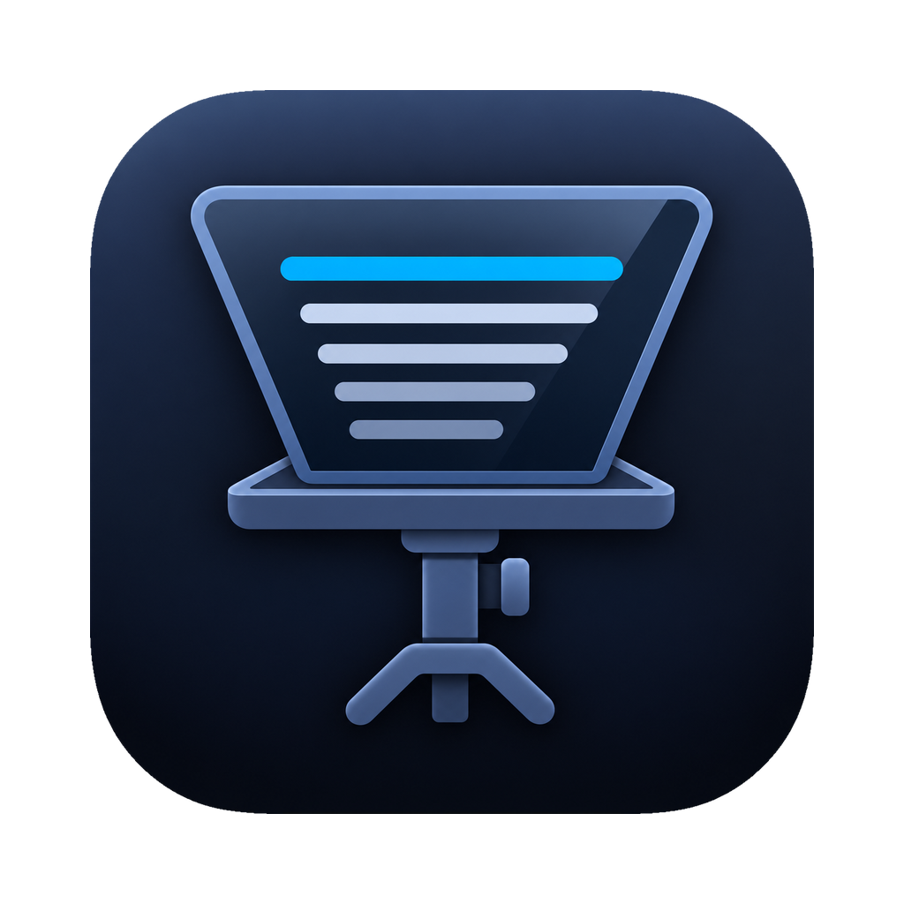
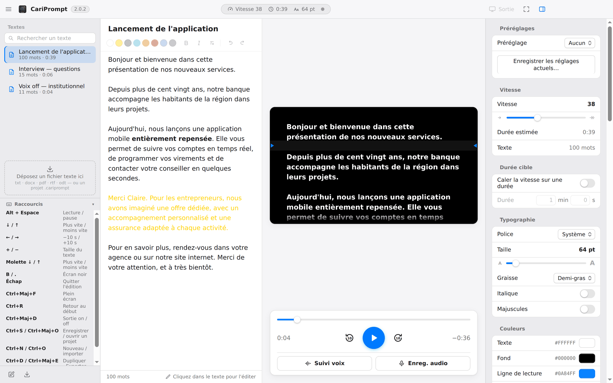
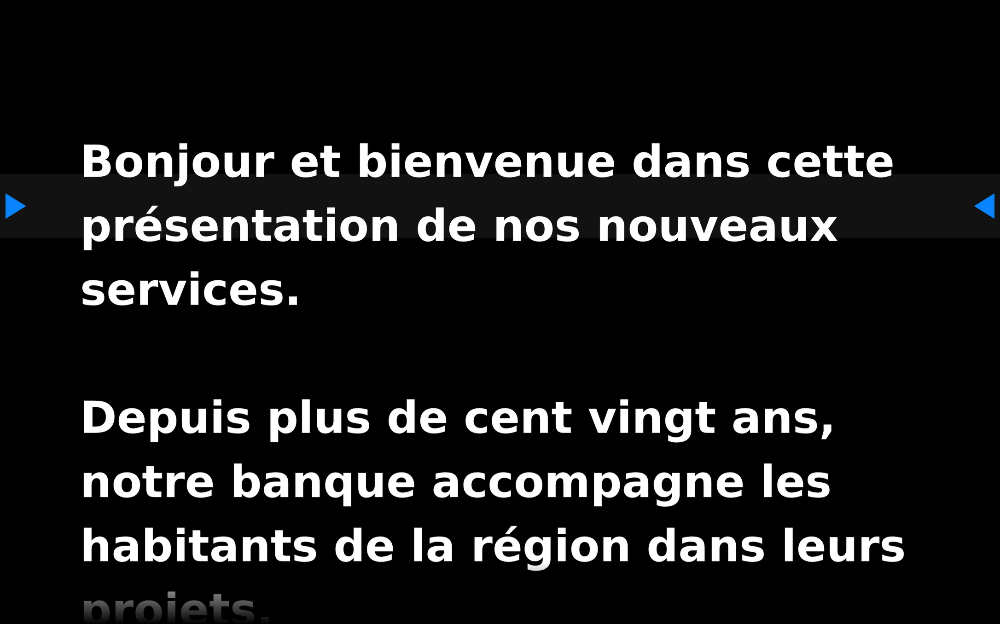

<p align="center">
  
</p>

<h1 align="center">CariPrompt</h1>

<p align="center">
  Teleprónter multipantalla, sencillo y moderno, para macOS, Windows y Linux.<br>
  <strong>Gratuito y de código abierto</strong> — una herramienta de <a href="https://github.com/CaribouNathan">Caribou Labs</a>.
</p>

<p align="center">
  <a href="https://github.com/CaribouNathan/CariPrompt/releases/latest"></a>
  
  <a href="LICENSE"></a>
  
</p>

<p align="center">
  <a href="README.md">Français</a> ·
  <a href="README.en.md">English</a> ·
  <strong>Español</strong> ·
  <a href="README.de.md">Deutsch</a> ·
  <a href="README.it.md">Italiano</a>
</p>

<p align="center">
  
</p>

---

## Índice

- [Presentación](#presentación)
- [Funciones](#funciones)
- [Descargar](#descargar)
- [Instalación — aplicación sin firmar](#instalación--aplicación-sin-firmar)
- [Primeros pasos](#primeros-pasos)
- [Atajos](#atajos)
- [Mando de presentación](#mando-de-presentación)
- [Formatos importables](#formatos-importables)
- [Proyectos y preajustes](#proyectos-y-preajustes)
- [¿Dónde se guardan mis guiones?](#dónde-se-guardan-mis-guiones)
- [Historial de versiones](#historial-de-versiones)
- [Limitaciones conocidas](#limitaciones-conocidas)
- [Compilar desde el código fuente](#compilar-desde-el-código-fuente)
- [Licencia](#licencia)

## Presentación

CariPrompt convierte cualquier ordenador en una regiduría de teleprónter:

- la **pantalla del operador** sirve para escribir y corregir el texto, ajustar la velocidad y controlar la reproducción;
- la **pantalla de salida** (monitor de teleprónter, televisor, proyector, iPad utilizado como pantalla) muestra el texto a pantalla completa, invertido para el cristal semirreflectante;
- la **pantalla completa** sustituye a las dos para un uso en solitario, frente al ordenador.

La aplicación es **gratuita, de código abierto (licencia MIT), sin cuenta, sin publicidad y sin conexión a Internet**. Ningún dato sale de su ordenador.

### Funciona sin conexión, por diseño

Sin telemetría, sin comprobación de licencia, sin ninguna petición al iniciar. Todo lo que se usa durante un rodaje —visualización, desplazamiento, velocidad, espejo, controles, grabación de las tomas, proyectos locales— funciona sin conexión, incluso en el primer inicio.

Dos excepciones, ambas provocadas por un clic y nunca durante la reproducción:
- la **redacción IA** (traducción, adaptación oral) contacta con el proveedor elegido;
- la **transcripción** descarga una vez su modelo Whisper; después funciona por completo sin conexión.

### Rendimiento

Mediciones sobre un guion de **20 000 palabras** (2 h 22 min de lectura), con renderizado por software y sin aceleración gráfica:

| Indicador | Valor |
|---|---|
| Tiempo por fotograma durante el desplazamiento | 16,7 ms (mediana), 17,6 ms en el peor caso |
| Fotogramas perdidos | ninguno |
| Nodos mostrados | 515 |
| Memoria JavaScript | 10 MB |

El desplazamiento se mantiene en 60 fotogramas por segundo sin tirones. Se aplica directamente al DOM mediante `requestAnimationFrame`, fuera del ciclo de renderizado de la interfaz: el tamaño del guion no afecta a la fluidez.

## Funciones

### Reproducción y velocidad

- **Velocidad de 0 a 100**, en pasos de 1 (0 = texto parado, 35 ≈ ritmo hablado habitual). Internamente, 1 punto equivale a 4 palabras por minuto.
- **Duración estimada** calculada en directo a partir del número de palabras y de la velocidad.
- **Duración objetivo**: indique la duración deseada para el vídeo y la velocidad se calcula automáticamente. Aparece un aviso si la duración exige una velocidad fuera de rango. Cualquier cambio manual de la velocidad desactiva la duración objetivo.
- **Cuenta atrás de 3 segundos** antes de cada inicio (se puede desactivar). Espacio durante la cuenta atrás la cancela.
- **Navegación** en pasos de 10 segundos, por párrafo, con la rueda sobre la vista previa, y barra de progreso en la que se puede hacer clic.
- **Clic en el editor**: la vista previa se sitúa inmediatamente en el pasaje sobre el que se ha hecho clic.
- **Cambio de velocidad y de tamaño en plena reproducción**, sin saltos del texto: la posición se conserva.
- **Código de tiempo** opcional en la pantalla del presentador: cronómetro real de la toma (pausas excluidas, puesto a cero al volver al principio), tiempo restante estimado, o ambos.
- **Pantalla en negro** instantánea (tecla <kbd>B</kbd> o <kbd>.</kbd>), como en PowerPoint.
- **Desplazamiento fluido** sincronizado con el refresco de la pantalla, **suspensión bloqueada** durante la reproducción.

### Texto y tipografía

- **Estilo por selección**: seleccione una parte del texto y dele un color, negrita o cursiva. Pensado para asignar **un color a cada interviniente** en un diálogo. Los estilos siguen al texto cuando lo edita.
- **Fuente** a elegir entre todas las fuentes instaladas en el ordenador.
- **Grosor** (de fina a negra), **cursiva**, **mayúsculas**.
- **Colores** del texto, del fondo y de la línea de lectura, con vuelta a los colores por defecto.
- **Tamaño** de 24 a 500 pt e **interlineado** de 1 a 2,5.
- **Alineación** a la izquierda o centrada, **márgenes** laterales ajustables.
- **Corrector ortográfico** en el editor, ajustado al idioma de la interfaz.
- **Deshacer y rehacer**: <kbd>⌘</kbd><kbd>Z</kbd> y <kbd>⌘</kbd><kbd>⇧</kbd><kbd>Z</kbd> en Mac, <kbd>Ctrl</kbd><kbd>Z</kbd> y <kbd>Ctrl</kbd><kbd>Y</kbd> en los demás sistemas. Las pulsaciones seguidas cuentan como un solo paso, los cambios de color forman uno aparte, y el cursor vuelve al punto modificado.

### Visualización y pantallas

- **Espejo** a elegir: ninguno, horizontal (cristal de teleprónter clásico), vertical o ambos (giro de 180°). Ajustes independientes para la vista previa y la pantalla completa.
- **Vista previa fiel**: la vista previa se renderiza a la resolución exacta de la pantalla de salida, de modo que los saltos de línea son idénticos.
- **Línea de lectura** señalada por dos flechas y una banda, con posición ajustable, que se puede mostrar u ocultar.
- **Degradado** en la parte superior e inferior de la pantalla para mantener la mirada en la línea activa.
- Salida a **cualquier pantalla conectada**, a pantalla completa sin bordes, con detección automática de conexiones y desconexiones.
- **Pantalla completa** para el uso en solitario: botón en la barra de herramientas o <kbd>⌘</kbd><kbd>⇧</kbd><kbd>F</kbd> / <kbd>Ctrl</kbd><kbd>Mayús</kbd><kbd>F</kbd>, salida con <kbd>Esc</kbd>.
- El teclado y la rueda funcionan también cuando el ratón está sobre la pantalla de salida.

<p align="center">
  
</p>

### Tomas

El botón **Grabar audio**, bajo los controles de reproducción, inicia una **toma**, que arrastra al teleprónter: cuenta atrás y después desplazamiento; al detenerla, el teleprónter se pone en pausa.

Las tomas están vinculadas al guion para el que se grabaron: el bloque solo muestra las del guion abierto, y una casilla «Todas las tomas» da acceso al conjunto. Cada toma recibe automáticamente el nombre **TOMA 01**, **TOMA 02**… (la numeración vuelve a 01 en cada guion) y conserva su hora, su duración, el guion utilizado, la posición alcanzada, la velocidad y su análisis. Se puede **renombrar, bloquear, anotar, marcar, reproducir, comparar, mostrar en el Finder, exportar y eliminar**. Una toma bloqueada no se puede renombrar ni eliminar. El audio se graba en **WAV** (PCM de 16 bits, mono, a la frecuencia del micrófono): sin comprimir, legible por todos los programas de edición y directamente aprovechable por la transcripción prevista en la 2.0.

### Entrenador de ritmo

Durante una toma, el sonido se analiza de forma continua, **sin transcripción**: nivel, actividad vocal, ataques silábicos. CariPrompt deduce de ello un ritmo aproximado, lo compara con la velocidad del teleprónter y muestra una indicación discreta: «Buen ritmo», «Baje un poco el ritmo», «Acelere un poco». Solo aparece tras 2,5 segundos de estabilidad, nunca interrumpe la reproducción, y un interruptor la desactiva por completo.

Cada toma conserva su análisis: ritmo medio, diferencia con el teleprónter, número de pausas, silencio total, tiempo de habla, irregularidad.

> [!NOTE]
> Este análisis en directo se basa únicamente en la señal de audio: sitúa un ritmo, no lee las palabras. El análisis del discurso, palabra por palabra, se hace después de la toma, a partir de la transcripción (véase más abajo).

### Seguimiento de voz

El botón **Seguir voz**, bajo los controles de reproducción, hace que el teleprónter **siga su voz**: el texto avanza cuando usted habla, **se detiene cuando hace una pausa** y **alcanza un pasaje omitido**, con la indicación «Pasaje omitido» en pantalla si el entrenador está activo. Si retrocede para repetir una frase, el texto vuelve ahí también. Todo ocurre en el ordenador, sin conexión.

Cómo funciona:
1. **Reconocimiento continuo.** Whisper no transcribe en flujo: en cuanto queda libre y ha llegado habla nueva, se relanza sobre los últimos seis segundos del enunciado en curso. La detección de actividad vocal decide cuándo descodificar, nunca sobre silencio, donde Whisper tiende a inventarse texto.
2. **Alineación.** El final de cada transcripción se ajusta al texto mediante una alineación local palabra por palabra (Smith-Waterman), tolerante con las palabras mal reconocidas, dentro de una ventana alrededor de la posición actual. Retroceder cuesta más que avanzar, y un salto grande exige una correspondencia fuerte: el seguimiento no se dispara ante una frase parecida.
3. **Regulación.** Diez veces por segundo, la velocidad de desplazamiento pasa a ser su ritmo medido más una corrección de la diferencia. Una **predicción** compensa la latencia de Whisper: entre dos transcripciones, la posición avanza a su ritmo.

El seguimiento usa el **más ligero de los modelos instalados**, para lograr la menor latencia: descargue **Base** (198 MB) aunque transcriba las tomas con Turbo. El seguimiento de voz y la velocidad fijada no se combinan: cuando el seguimiento está activo, es su voz la que marca el ritmo; cuando se desactiva, la velocidad fijada vuelve a mandar.

> [!NOTE]
> Mediciones de desarrollo, con voz sintética y un procesador de 2 núcleos: diferencia mediana entre la voz y el texto de 1,8 palabras con el motor solo, y de 3 palabras en la aplicación completa, donde Whisper dispone de un único núcleo y tarda 1,5 s por descodificación. En un Mac reciente, Whisper Base descodifica en una fracción de segundo: la diferencia se reduce en la misma medida.

### Transcripción, análisis del discurso y subtítulos

Cada toma puede **transcribirse en el ordenador, sin conexión**, con Whisper. El modelo se descarga una vez desde el bloque **Transcripción**; después, cada toma se transcribe automáticamente al terminar la grabación (se puede desactivar), o cuando usted lo pida.

| Modelo | Descarga | En el disco | Observación |
|---|---|---|---|
| **Turbo** (por defecto) | 538 MB | 1,0 GB | El más preciso, y más rápido que Small |
| Small | 610 MB | 375 MB | Intermedio |
| Base | 198 MB | 160 MB | El más ligero, sensiblemente menos preciso en francés |

Mediciones de desarrollo, sobre una voz sintética francesa en condiciones limpias y un procesador de 2 núcleos: Turbo solo cometió un error de palabra por cada 150, y transcribe un minuto de toma en unos 30 segundos. Una voz real, una sala real y un Mac de 10 núcleos cambiarán estas cifras: la precisión a la baja, la velocidad al alza.

**Análisis del discurso**, comparado con el texto del teleprónter:

| Medida | Qué indica |
|---|---|
| Fidelidad al guion | proporción de las palabras del pasaje leído realmente pronunciadas |
| Pasajes omitidos | fragmentos de al menos tres palabras no pronunciadas; un clic lleva el teleprónter hasta ahí |
| Palabras añadidas | palabras pronunciadas que no están en el texto |
| Ritmo | palabras por minuto, entre la primera y la última intervención |
| Muletillas, repeticiones | «eh», «o sea», «vamos a, vamos a»… contadas solo si no están en el texto |
| Vacilaciones | pausas de más de 0,8 s en mitad de una frase |

Las indicaciones entre corchetes (`[SONRISA]`) se ignoran, y «ciento veinte» en el texto se corresponde correctamente con «120» en la transcripción.

> [!IMPORTANT]
> Whisper **tiende a eliminar las disfluencias**: «eh», falsos comienzos, palabras repetidas. El modelo Turbo lo hace más que Base. Por tanto, los recuentos de muletillas y de repeticiones son **mínimos**. En cambio, los pasajes omitidos, la fidelidad y las vacilaciones no dependen de ese comportamiento.

**Subtítulos**: la transcripción se divide según los usos de difusión —dos líneas de 42 caracteres como máximo, de 1 a 7 segundos en pantalla, 17 caracteres por segundo como máximo— cortando preferentemente en los finales de frase, en las comas y antes de las conjunciones, nunca después de un artículo o una preposición. Los cortes se ajustan a los silencios reales. El editor permite reproducir la toma, corregir el texto, ajustar los tiempos (↑/↓ para ±0,1 s), dividir en el cursor, fusionar y eliminar; los subtítulos demasiado rápidos se señalan. **Exportación en SRT** (UTF-8 con BOM, finales de línea CRLF, para los programas de edición).

### Redacción IA

Dos transformaciones, a partir del guion abierto, que producen cada una un **guion nuevo** situado justo debajo; el original nunca se modifica:

- **Traducir el guion** al inglés, francés, español, alemán, italiano, portugués o neerlandés. La instrucción pide una adaptación para el oído, no una traducción palabra por palabra.
- **Adaptar para decirlo en voz alta**: frases cortas que caben en una respiración, listas convertidas en frases, eliminación de lo que no se dice (paréntesis, abreviaturas, «cf.»). Una pausa corta se marca con «/», una pausa larga con un nuevo párrafo, y las palabras que se acentúan pasan a **negrita**. No se elimina ninguna información, ninguna cifra, ningún nombre ni ninguna llamada a la acción.

Hay tres salvaguardas que no dependen del modelo:

| Elemento | Tratamiento |
|---|---|
| URL, correos electrónicos, variables (`{{prenom}}`, `{x}`, `%s`, `$VAR`), indicaciones entre corchetes (`[SONRISA]`) | **Sustituidos por testigos antes del envío** y restaurados después de forma idéntica. El proveedor no los ve. |
| Cifras | Comparadas entre el original y el resultado. Todo párrafo en el que una cifra haya desaparecido o cambiado se **señala con su número**. |
| Colores de interviniente | El color de un párrafo se aplica a todos los párrafos en los que se convierte. La negrita parcial se conserva. |

El proveedor se elige en el bloque: **Claude (Anthropic)** u **OpenAI**, con su propia clave API. La lista de modelos se lee directamente en el proveedor; por defecto, Claude Sonnet 5 y GPT-5.6 Terra. La clave se guarda cifrada en el llavero del sistema (Llavero de macOS, Administrador de credenciales de Windows, llavero de GNOME/KDE), nunca se transmite a la interfaz y solo se envía al proveedor elegido. Los guiones largos se envían en lotes de unas 1 200 palabras, tres a la vez, con una barra de progreso y un botón de cancelación.

> [!NOTE]
> En macOS, al no estar la aplicación firmada por un desarrollador identificado, el Llavero puede pedirle su contraseña después de cada actualización para autorizar a CariPrompt a leer de nuevo su clave. Elija «Permitir siempre».

### Guiones, proyectos y preajustes

- **Biblioteca de guiones**: tantos guiones como haga falta, cada uno con su velocidad, su duración objetivo y sus colores.
- **Guiones incluidos**: un guion **Welcome** que presenta todas las funciones en los cinco idiomas de la interfaz, y un **guion de prueba** corto por idioma para ajustar la velocidad y probar el seguimiento de voz. Se añaden una sola vez; los antiguos guiones de bienvenida sin modificar se sustituyen, y los que usted haya retocado se conservan.
- **Selección múltiple** como en el Finder: <kbd>⇧</kbd> + clic para un rango, <kbd>⌘</kbd> / <kbd>Ctrl</kbd> + clic para añadir o quitar un guion. El clic derecho actúa entonces sobre toda la selección.
- **Búsqueda por palabra clave** en los títulos, en la parte superior de la lista. No distingue mayúsculas ni acentos: «presi» encuentra «Discurso del presidente».
- **Guardado automático** con cada modificación y al cerrar.
- **Importación** arrastrando y soltando en cualquier punto de la ventana, mediante la zona de destino de la columna izquierda, o con el botón específico. Cada archivo se convierte en un guion nuevo: no se sobrescribe nada.
- **Duplicar, exportar como .txt, eliminar** (clic derecho sobre un guion), con posibilidad de deshacer la eliminación durante 6 segundos.
- **Proyectos `.cariprompt`**: un guion y todos sus ajustes en un archivo.
- **Preajustes**: el conjunto de los ajustes de visualización guardado con un nombre («iPad CACE», «Estudio 2»…) y recuperado con un clic. También memorizan el orden de los bloques del panel.
- **Panel de ajustes reordenable**: cada bloque se desplaza arrastrándolo por su encabezado, para poner arriba los que más usa. El orden vuelve a la disposición por defecto en el siguiente inicio; para conservarlo, guárdelo en un preajuste.

### Interfaz

- **Cinco idiomas**: inglés (por defecto), francés, español, alemán, italiano. Los menús, los cuadros de diálogo, los mensajes y el corrector ortográfico siguen el idioma elegido.
- **Apariencia Sistema, Claro u Oscuro** (Sistema por defecto).
- Estilo macOS, idéntico en Windows y Linux.
- **Recordatorio de atajos** plegable en la parte inferior de la columna izquierda.
- **Ningún sonido**: la interfaz no emite ningún pitido, ni siquiera ante una tecla no reconocida.
- Número de versión mostrado junto al nombre de la aplicación.
- **Panel de ajustes por pestañas**: **Esencial** (salida, velocidad, duración objetivo, controles, mando), **Diseño** (tipografía, colores, composición, código de tiempo), **Transcripción** (tomas, transcripción), **Herram. IA** y **Personal**. En cada pestaña, los bloques se reordenan arrastrando y soltando y se pliegan con la flecha de su línea de título; la «i» da la explicación del bloque.
- **Pestaña Personal**: el menú de la parte superior de la pestaña añade cualquier bloque, que permanece también en su pestaña de origen. Su contenido se conserva al reiniciar, y los preajustes guardan varias disposiciones.
- **En macOS**, las columnas laterales dejan ver la materia del sistema (vibrancia), como las barras laterales de las aplicaciones de Apple, y las líneas de separación de las zonas grandes dan paso a simples diferencias de tono.
- **Actualizaciones**: en la parte inferior del panel, «Buscar actualizaciones» consulta la última versión publicada en GitHub. La comprobación al iniciar se puede desactivar; no se envía ningún dato y la instalación sigue siendo manual.

### Menús

| Sistema | Ubicación |
|---|---|
| macOS | Barra de menús en la parte superior de la pantalla: **CariPrompt**, **Archivo**, **Edición**, **Presentación** (Apariencia, Idioma), **Teleprónter**, **Ventana** — y botón **☰** en la ventana |
| Windows / Linux | Botón **☰** en la parte superior izquierda de la ventana |

El botón **☰** da acceso, en los tres sistemas, a **Archivo**, **Teleprónter**, **Apariencia**, **Idioma**, **Acerca de** y **Salir**.
En inglés, los menús se llaman *File*, *Edit*, *View* (*Appearance*, *Language*), *Prompter*, *Window*.
Las preferencias de idioma y de apariencia se guardan y se recuperan en el siguiente inicio.

## Descargar

Los archivos están disponibles en la página **[Releases](https://github.com/CaribouNathan/CariPrompt/releases/latest)**.

| Sistema | Archivo | Observación |
|---|---|---|
| macOS — Apple Silicon (M1 a M4) | `CariPrompt-2.2.2-macOS-AppleSilicon.dmg` | macOS 12 o posterior, instalación arrastrando y soltando |
| macOS — Apple Silicon (M1 a M4) | `CariPrompt-2.2.2-macOS-AppleSilicon.zip` | La misma aplicación, sin imagen de disco |
| Windows 10 / 11 (64 bits) | `CariPrompt-2.2.2-Windows-Setup.exe` | Instalador clásico |
| Windows 10 / 11 (64 bits) | `CariPrompt-2.2.2-Windows-Portable.exe` | Sin instalación, se ejecuta directamente |
| Linux x86_64 | `CariPrompt-2.2.2-Linux-x86_64.AppImage` | Todas las distribuciones |
| Debian, Ubuntu y derivados | `CariPrompt-2.2.2-Linux-amd64.deb` | Paquete instalable |

> Desde la 2.0.2 solo se publican los Mac **Apple Silicon** (M1 y posteriores): menú  › **Acerca de este Mac**, línea **Chip**. En un Mac Intel, la aplicación se compila desde el código fuente con `MAC_ARCHS=x64 npm run dist:mac`.

## Instalación — aplicación sin firmar

> [!IMPORTANT]
> CariPrompt es un proyecto personal gratuito. **No está firmado** con un certificado Apple Developer ni con un certificado de firma de código de Windows: esos certificados son de pago y anuales.
> Por eso su sistema mostrará un aviso en el primer inicio. Es normal. El código fuente se puede consultar íntegramente en este repositorio.

### macOS

1. Abra el `.dmg` y arrastre **CariPrompt** al acceso directo **Aplicaciones** (o descomprima el `.zip` y arrastre **CariPrompt.app** a **Aplicaciones**).
2. Abra la aplicación. macOS indica que no se puede verificar: haga clic en **Hecho** (o en **OK**).
3. Abra **Ajustes del Sistema › Privacidad y seguridad**. En la parte inferior de la página, junto al mensaje relativo a CariPrompt, haga clic en **Abrir igualmente** y confirme.
4. Vuelva a abrir CariPrompt: el aviso ya no aparecerá.

**Otro método, desde el Terminal** (elimina el atributo de cuarentena añadido por el navegador):

```bash
xattr -cr /Applications/CariPrompt.app
```

> Si macOS indica que la aplicación «está dañada», se trata de la misma protección: utilice el comando anterior.

### Windows

1. Ejecute `CariPrompt-2.2.2-Windows-Setup.exe` (o la versión portátil).
2. Aparece **Windows protegió su PC** (SmartScreen): haga clic en **Más información** y luego en **Ejecutar de todas formas**.
3. El instalador permite elegir la carpeta de instalación. Se crea un acceso directo en el menú Inicio y en el escritorio.

### Linux

**AppImage**:

```bash
chmod +x CariPrompt-2.2.2-Linux-x86_64.AppImage
./CariPrompt-2.2.2-Linux-x86_64.AppImage
```

Algunas distribuciones recientes requieren la biblioteca FUSE 2 (`sudo apt install libfuse2t64` en Ubuntu 24.04).

**Paquete .deb**:

```bash
sudo apt install ./CariPrompt-2.2.2-Linux-amd64.deb
```

## Primeros pasos

1. **Cargue el guion**: escríbalo, péguelo o suelte un archivo en la ventana.
2. **Coloree a los intervinientes** (opcional): seleccione una réplica y haga clic en un color de la barra **Selección**.
3. **Ajuste la velocidad**, o active **Duración objetivo** e indique la duración deseada.
4. **Elija la pantalla de salida** y el **espejo**, y haga clic en **Mostrar la salida**. Si no tiene una segunda pantalla, utilice la **pantalla completa**.
5. **Inicie** con <kbd>⌥</kbd><kbd>Espacio</kbd>. Ajuste en directo con la rueda o con las flechas.
6. **Guarde** sus ajustes como preajuste, o el conjunto de guion + ajustes como proyecto `.cariprompt`.

## Atajos

Los atajos del teleprónter están activos en cuanto el cursor no está en un campo de escritura. <kbd>Esc</kbd> sale del área de texto, y un clic en la vista previa también.

| Tecla | Acción |
|---|---|
| <kbd>⌥</kbd> <kbd>Espacio</kbd> (<kbd>Alt</kbd> <kbd>Espacio</kbd> en Windows y Linux) | Reproducir / pausar (cancela la cuenta atrás si está en curso). Funciona también mientras se escribe el texto. |
| <kbd>↓</kbd> / <kbd>↑</kbd> | Más rápido / más lento (±1) |
| <kbd>←</kbd> / <kbd>→</kbd> | Retroceder / avanzar 10 segundos |
| <kbd>+</kbd> / <kbd>−</kbd> | Aumentar / reducir el texto, incluso durante la reproducción |
| Rueda o trackpad sobre la vista previa | Navegar por el guion (<kbd>⌥</kbd>: ajustar la velocidad) |
| Rueda o trackpad en otro punto | Más rápido / más lento |
| <kbd>B</kbd> o <kbd>.</kbd> | Pantalla en negro |
| <kbd>Av Pág</kbd> / <kbd>Re Pág</kbd> | Botones del mando (acciones configurables) |
| <kbd>F5</kbd> | Reproducir |
| <kbd>Inicio</kbd> | Volver al principio |
| <kbd>Esc</kbd> | Salir del campo de escritura, o de la pantalla completa |

| macOS | Windows / Linux | Acción |
|---|---|---|
| <kbd>⌘</kbd> <kbd>Z</kbd> | <kbd>Ctrl</kbd> <kbd>Z</kbd> | Deshacer |
| <kbd>⌘</kbd> <kbd>⇧</kbd> <kbd>Z</kbd> | <kbd>Ctrl</kbd> <kbd>Y</kbd> | Rehacer |
| <kbd>⌘</kbd> <kbd>N</kbd> | <kbd>Ctrl</kbd> <kbd>N</kbd> | Nuevo guion |
| <kbd>⌘</kbd> <kbd>O</kbd> | <kbd>Ctrl</kbd> <kbd>O</kbd> | Importar archivos |
| <kbd>⌘</kbd> <kbd>S</kbd> | <kbd>Ctrl</kbd> <kbd>S</kbd> | Guardar el proyecto |
| <kbd>⌘</kbd> <kbd>⇧</kbd> <kbd>O</kbd> | <kbd>Ctrl</kbd> <kbd>Mayús</kbd> <kbd>O</kbd> | Abrir un proyecto |
| <kbd>⌘</kbd> <kbd>⇧</kbd> <kbd>F</kbd> | <kbd>Ctrl</kbd> <kbd>Mayús</kbd> <kbd>F</kbd> o <kbd>F11</kbd> | Pantalla completa |
| <kbd>⌘</kbd> <kbd>D</kbd> | <kbd>Ctrl</kbd> <kbd>D</kbd> | Duplicar el guion |
| <kbd>⌘</kbd> <kbd>⇧</kbd> <kbd>E</kbd> | <kbd>Ctrl</kbd> <kbd>Mayús</kbd> <kbd>E</kbd> | Exportar como .txt |
| <kbd>⌘</kbd> <kbd>R</kbd> | <kbd>Ctrl</kbd> <kbd>R</kbd> | Volver al principio |
| <kbd>⌘</kbd> <kbd>⇧</kbd> <kbd>D</kbd> | <kbd>Ctrl</kbd> <kbd>Mayús</kbd> <kbd>D</kbd> | Mostrar / ocultar la salida |
| <kbd>⌘</kbd> <kbd>⇧</kbd> <kbd>T</kbd> | <kbd>Ctrl</kbd> <kbd>Mayús</kbd> <kbd>T</kbd> | Seguimiento de voz (activar / desactivar) |
| <kbd>⌘</kbd> <kbd>⇧</kbd> <kbd>R</kbd> | <kbd>Ctrl</kbd> <kbd>Mayús</kbd> <kbd>R</kbd> | Grabación de audio (activar / desactivar) |

El sentido de la rueda sigue el ajuste **desplazamiento natural** de macOS. Se puede invertir en **Ajustes › Controles**, donde también se elige la acción de la rueda sobre la vista previa: **navegar por el guion** (por defecto) o **ajustar la velocidad**. La tecla <kbd>⌥</kbd> da la otra acción.
En la columna de edición, la lista de guiones y los ajustes, la rueda desplaza con normalidad.

## Mando de presentación

CariPrompt se controla con los mandos pensados para PowerPoint (Logitech R400 / R500 / Spotlight, Kensington, Targus…), que se comportan como un teclado:

| Botón | Acción |
|---|---|
| Siguiente (Av Pág) | A elegir, por defecto **reproducir / pausar** |
| Anterior (Re Pág) | A elegir, por defecto **retroceder 10 s** |
| Iniciar la presentación (F5) | Reproducir |
| Pantalla en negro (B o .) | Pantalla en negro / volver al texto |

Acciones disponibles para Siguiente y Anterior: reproducir / pausar, párrafo siguiente, párrafo anterior, avanzar o retroceder 10 s, más rápido, más lento, volver al principio, nada.

## Formatos importables

| Formato | Extensiones | Observación |
|---|---|---|
| Texto sin formato | `.txt` `.text` `.md` `.markdown` | UTF-8, UTF-16 o Windows-1252 detectados automáticamente |
| Word | `.docx` | |
| Word 97-2003 | `.doc` | Solo el texto principal |
| RTF | `.rtf` | |
| OpenDocument | `.odt` | LibreOffice, OpenOffice |
| HTML | `.html` `.htm` | |
| PDF | `.pdf` | Se eliminan los saltos de línea de maquetación |
| Proyecto CariPrompt | `.cariprompt` | Guion **y** ajustes |

No se admiten: los archivos **Pages** (hay que exportarlos primero a `.docx` o `.pdf`) ni los **PDF escaneados** sin capa de texto. La importación recupera el texto, no el formato del documento de origen.

## Proyectos y preajustes

|  | Proyecto `.cariprompt` | Preajuste |
|---|---|---|
| Contiene el guion y sus colores | Sí | No |
| Contiene los ajustes de visualización | Sí | Sí |
| Contiene el orden de los bloques del panel | Sí | Sí |
| Almacenamiento | Un archivo, en el lugar que usted elija | En la aplicación |
| Uso | Archivar o enviar un tema completo | Recuperar una configuración de equipo |

- **Guardar un proyecto**: <kbd>⌘</kbd><kbd>S</kbd> / <kbd>Ctrl</kbd><kbd>S</kbd>. **Abrirlo**: <kbd>⌘</kbd><kbd>⇧</kbd><kbd>O</kbd>, arrastrando y soltando, o con un doble clic en el archivo. El guion se añade a la biblioteca y los ajustes se aplican.
- **Guardar un preajuste**: botón **Guardar los ajustes actuales…** en la parte superior de los ajustes, y después un nombre («iPad CACE»). Un clic en su pastilla lo recupera, y la cruz lo elimina.
- En ambos casos, el **idioma**, la **apariencia** y la **pantalla de salida** no se incluyen: siguen siendo propios del ordenador utilizado.
- El archivo de proyecto está en formato JSON, legible y modificable.

## ¿Dónde se guardan mis guiones?

Los guiones (`scripts.json`) y los ajustes (`settings.json`, que contiene también los preajustes) se guardan localmente:

| Sistema | Carpeta |
|---|---|
| macOS | `~/Library/Application Support/CariPrompt/` |
| Windows | `%APPDATA%\CariPrompt\` |
| Linux | `~/.config/CariPrompt/` |

Las tomas están en la subcarpeta `takes/`: un archivo de audio por toma y un índice `index.json`.
Las claves API de la redacción IA están en `ai-keys.json`, cifradas por el llavero del sistema.
Los modelos de transcripción están en la subcarpeta `stt/`; se pueden eliminar desde el bloque Transcripción.
Para hacer una copia de seguridad de sus guiones o transferirlos, copie `scripts.json`.
En caso de problema, los errores internos se registran en `cariprompt.log`, en la misma carpeta.

## Historial de versiones

El detalle está en el [CHANGELOG](CHANGELOG.md).

| Versión | Tecnología | Plataformas | Novedades principales |
|---|---|---|---|
| **2.2.2** | Electron | macOS Apple Silicon, Windows, Linux | Vibrancia de macOS en las columnas, vista previa mejor separada, README en cinco idiomas |
| 2.2.1 | Electron | macOS Apple Silicon, Windows, Linux | Icono recortado, pestañas en una sola línea en todos los idiomas, columnas translúcidas en macOS |
| 2.2.0 | Electron | macOS Apple Silicon, Windows, Linux | Panel de ajustes por pestañas, bloques plegables, pestaña personalizable, comprobación de actualizaciones, imagen .dmg, aplicación aligerada |
| 2.1.0 | Electron | macOS Apple Silicon, Windows, Linux | Guion «Welcome» multilingüe y guiones de prueba incluidos; atajos para el seguimiento de voz y la grabación |
| 2.0.2 | Electron | macOS Apple Silicon, Windows, Linux | Nuevo icono; fin de la versión para Mac Intel |
| 2.0.1 | Electron | macOS, Windows, Linux | Botones «Seguir voz» y «Grabar audio» con su texto traducido y su estado |
| 2.0.0 | Electron | macOS, Windows, Linux | Seguimiento de voz: el teleprónter sigue la voz, se detiene en las pausas, alcanza los pasajes omitidos; texto hasta 500 pt |
| 1.9.1 | Electron | macOS, Windows, Linux | Mensaje claro cuando la cuenta API se queda sin crédito; vuelta de Windows, Linux y macOS Intel |
| 1.9.0 | Electron | macOS, Windows, Linux | Transcripción local (Whisper), análisis del discurso comparado con el texto, subtítulos y exportación SRT |
| 1.8.0 | Electron | macOS, Windows, Linux | Redacción IA: traducción y adaptación oral, Claude u OpenAI, elementos protegidos y cifras controladas |
| 1.7.3 | Electron | macOS, Windows, Linux | Grabación de las tomas en WAV, vinculadas a su guion, entrenador de ritmo, deshacer en el editor |
| 1.6.0 | Electron | macOS, Windows, Linux | Cinco idiomas de interfaz, búsqueda de guiones, rendimiento validado con 20 000 palabras |
| 1.5.0 | Electron | macOS, Windows, Linux | Panel de ajustes reordenable, texto hasta 400 pt, reproducir/pausar con ⌥ + Espacio |
| 1.4.2 | Electron | macOS, Windows, Linux | Navegación con la rueda, selección múltiple, sincronización con un clic, corrección de la barra de menús en macOS |
| 1.4.1 | Electron | macOS, Windows, Linux | Estilo por selección (un color por interviniente), preajustes, zona de destino, nuevo icono |
| 1.4.0 | Electron | macOS, Windows, Linux | Tipografía y colores, proyectos `.cariprompt`, mando de presentación, interlineado, velocidad 0–100, pantalla completa, código de tiempo |
| 1.3.1 | Electron | macOS, Windows, Linux | Línea de lectura ocultable, guiones de bienvenida en inglés y francés, correcciones de composición |
| 1.3.0 | Electron | macOS, Windows, Linux | Interfaz en inglés o en francés, apariencia Sistema / Claro / Oscuro, botón ☰ |
| 1.2.0 | Electron | macOS, Windows, Linux | Primera versión multiplataforma, icono, binarios listos para usar |
| 1.1.0 | SwiftUI | macOS | Importación de documentos, biblioteca de guiones |
| 1.0.0 | SwiftUI | macOS | Primera versión: salida en espejo, duración objetivo, cuenta atrás, atajos |

Las versiones 1.0 y 1.1 (nativas de macOS) quedan sustituidas por la versión Electron. En Mac, la biblioteca de guiones se conserva automáticamente de una versión a otra.

## Limitaciones conocidas

- **Aplicación sin firmar**: aviso en el primer inicio (véase [Instalación](#instalación--aplicación-sin-firmar)).
- **Velocidad uniforme en altura**: la velocidad se calcula a partir del número medio de palabras por línea. Una línea corta pasa a la misma velocidad que una línea completa.
- **Fuentes**: la lista se lee la primera vez que se muestran los ajustes (unos segundos en un Mac con muchas fuentes). Una fuente ausente en el ordenador que abre un proyecto se sustituye por la fuente del sistema.
- **Código de tiempo restante**: es una estimación basada en la velocidad actual, y cambia si la velocidad cambia.
- **Trackpad**: la inercia no se puede distinguir de un gesto voluntario, por lo que la cadencia de cambio de velocidad está limitada.
- **Sin actualización automática**: las nuevas versiones hay que descargarlas en las Releases.
- **Linux**: solo se publica la arquitectura x86_64.
- **Seguimiento de voz**: hay que leer el texto. Una improvisación que se aleje de él hace que el seguimiento pase al estado «perdido» (botón naranja): el texto espera a que la voz vuelva a encontrar el guion. Una frase repetida en otro punto del texto puede, en contadas ocasiones, atraer el seguimiento; se vuelve a ajustar en la frase siguiente.
- **Transcripción**: Whisper no proporciona la marca de tiempo de cada palabra con estos modelos, solo la de cada segmento. Por eso la división de los subtítulos dentro de un segmento es proporcional, ajustada a los silencios detectados. Los recuentos de muletillas y de repeticiones son mínimos (véase más arriba).
- **Redacción IA**: el control de las cifras compara secuencias de dígitos, no valores. «10000» reescrito como «10 000» se señala por error; a la inversa, una cifra desplazada a otra frase del mismo párrafo pasa desapercibida. Un paréntesis final de una URL (`…/Page_(X)`) se toma por puntuación.

## Compilar desde el código fuente

Requisito previo: [Node.js](https://nodejs.org) 22 o posterior.

```bash
git clone https://github.com/CaribouNathan/CariPrompt.git
cd CariPrompt
npm install
npm start            # inicia la aplicación en modo de desarrollo
```

Creación de los paquetes (depositados en `release/`):

| Comando | Resultado | Ejecutar desde |
|---|---|---|
| `npm run dist:mac` | `.zip` Apple Silicon firmado de forma ad hoc (`MAC_ARCHS=x64` para Intel) | macOS o Linux (con [rcodesign](https://github.com/indygreg/apple-platform-rs)) |
| `npm run dist:win` | Instalador NSIS y versión portátil | Windows, o Linux/macOS con Wine |
| `npm run dist:linux` | AppImage y `.deb` | Linux |

En Mac, `build.command` encadena la instalación de las dependencias y la creación de los paquetes.

### Arquitectura

```
src/
├── main/          Proceso principal de Electron
│   ├── main.ts        ventanas de operador y de salida, pantallas, almacenamiento, menús, proyectos
│   ├── preload.ts     API expuesta a la interfaz
│   ├── importer.ts    lectura de txt, rtf, doc, docx, odt, html, pdf
│   ├── fonts.ts       lista de las fuentes instaladas
│   ├── takes.ts       almacenamiento de las tomas y de su índice
│   ├── ai.ts          claves API, llamadas a Claude / OpenAI, testigos protegidos, control de las cifras
│   ├── stt.ts         modelos Whisper: descarga, extracción, cola de transcripción, seguimiento de voz
│   ├── liveStt.ts     reconocimiento continuo: VAD en flujo, Whisper por ventanas deslizantes
│   ├── sttEngine.ts   WAV, remuestreo a 16 kHz, VAD Silero, Whisper por ventanas
│   └── sttExtract.ts  extracción .tar.bz2 de respaldo, en un hilo
├── renderer/      Interfaz React
│   ├── App.tsx            pantalla del operador y pantalla completa
│   ├── Output.tsx         pantalla de salida
│   ├── PrompterCanvas.tsx renderizado, desplazamiento, código de tiempo
│   ├── RichEditor.tsx     editor con estilos por selección
│   ├── recorder.ts        grabación del micrófono y análisis de la señal
│   ├── pcmTap.ts          captura PCM (AudioWorklet), wav.ts: codificación WAV
│   ├── aiText.ts          división en párrafos, traslado de los estilos
│   ├── speechAnalysis.ts  alineación palabra por palabra, pasajes omitidos, muletillas, vacilaciones
│   ├── liveAlign.ts       alineación en directo (Smith-Waterman), ritmo, predicción
│   ├── subtitles.ts       división según las normas de difusión, SRT
│   ├── store.ts           estado, reproducción, biblioteca, proyectos, tomas (zustand)
│   └── input.ts           teclado, rueda, mando
└── shared/        Código común
    ├── types.ts       tipos y cálculos
    ├── marks.ts       estilos parciales del texto
    ├── i18n.ts        traducciones
    └── locales/       en, fr, es, de, it
```

Principio de sincronización: la posición de lectura es un progreso de 0 a 1, independiente de la composición. La pantalla del operador envía un punto de anclaje (posición y marca de tiempo) a la pantalla de salida. Después, cada ventana calcula su posición en cada fotograma. Las dos pantallas siguen sincronizadas sin intercambio continuo.

Stack: Electron, React, TypeScript, Vite, zustand, mammoth, word-extractor, unpdf, JSZip, sherpa-onnx (Whisper, VAD Silero).

### Contribuir

Los informes de errores y las sugerencias son bienvenidos en las [Issues](https://github.com/CaribouNathan/CariPrompt/issues). Indique su sistema, la versión de CariPrompt y, si es posible, el archivo afectado.

## Hoja de ruta — de la 1.6 a la 2.0

| Etapa | Contenido | Estado |
|---|---|---|
| 1.6.0 | Cinco idiomas, búsqueda de guiones, funcionamiento sin conexión garantizado, rendimiento validado | entregado |
| 1.7.3 | Grabación y gestión de las tomas, entrenador de ritmo, deshacer en el editor | entregado |
| 1.8.0 | Traducción de guiones, transformación de escrito a oral (Claude u OpenAI) | entregado |
| **1.9.0** | Transcripción local (Whisper), subtítulos y exportación SRT, análisis del discurso tras la toma | entregado |
| **2.0.0** | Seguimiento de voz en tiempo real | entregado |

Las funciones de transcripción usarán un motor **local**, para seguir siendo utilizables en rodaje sin red. Las funciones de texto por IA (traducción, adaptación oral) requerirán una conexión y una clave API proporcionada por el usuario; seguirán siendo opcionales y sin efecto sobre el teleprónter en sí.

## Licencia

CariPrompt es un **software libre y gratuito**, distribuido bajo [licencia MIT](LICENSE).
Puede utilizarlo, incluso para rodajes comerciales, modificarlo y redistribuirlo libremente.

© 2026 Nathan Carrillat — Caribou Labs
